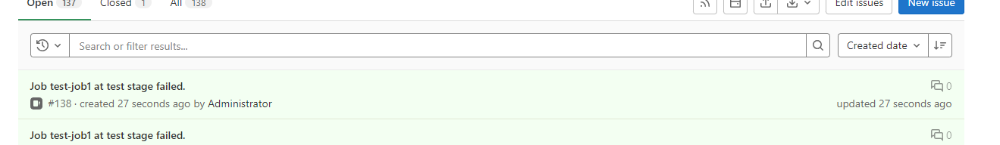

# Readme #

I'm working on mistakes in a dev branch. I will not update the main branch because the challenge was restricted by time.

**The script works only in Linux environment.**
**Before usage install the GitLab library:** 
```commandline
# pip install python-gitlab
```

## Overview

The script shows statuses of the last pipelines in every branch of a project and current problems.
Also, you can save logs of failed jobs, report issues and rebuild failed jobs.
Don't forget specify a project name and a host of gitlab.
Please put your token in file ./token_file in the same directory or use the `--token` key.

Usage:

`./pipelineCheck [OPTIONS]`

`--gitlab_host=` - Specify your GitLab host. Default value - localhost

`--project_name=` - Specify your project name.

`--token=`- Set token

`--report-problems` - Send an issue about slow or failed jobs in the last pipelines

`--trigger-failed` - Trigger all failed jobs in the last pipelines

`--duration_limit=` - Any running job will be considered slow if it exceeds this limit. Default value - 600 seconds.

`--fetch-logs` - Get logs from all failed jobs in the last pipelines. They will be stored in files of a current directory

## Expected behavior ##

The tool checks one last pipeline of each branch in a specified project. If there are no parameters default will be used. If it doesn't find any problems only a short statistic will be given.

```commandline
alterego@LAPTOP-5BA307EG:~/pipelineMonitor$ ./pipelineMonitor
Using default host:  http://localhost/
Using default project name:  gitlab-instance-831d1df5/mytestproject

BRANCH:  justForFun
Pipeline ID:  17
STATUS:  success

BRANCH:  master
Pipeline ID:  16
STATUS:  success
```
Problem reports. Only two types of problems at the moment :(
We get more info if a job failed, or it lasts more duration_limit.
```commandline
alterego@LAPTOP-5BA307EG:~/pipelineMonitor$ ./pipelineMonitor --duration_limit=1
Using default host:  http://localhost/
Using default project name:  gitlab-instance-831d1df5/mytestproject

BRANCH:  master
Pipeline ID:  20
STATUS:  running
====================================================
    Job ID:  79 Job Name:  test-job2 Stage: test
    JOB STATUS:  running
    IMPACTED STAGE:  test
('URL: ', 'http://gitlab.example.com/gitlab-instance-831d1df5/mytestproject/-/jobs/79')
    The job is slow:  3.177318355
    TRACE:
     which simulates a test that runs 20 seconds longer than test-job1
    $ echo "blabla test failed"
    blabla test failed
    $ sleep 30

====================================================
    Job ID:  78 Job Name:  test-job1 Stage: test
    JOB STATUS:  failed
    IMPACTED STAGE:  test
('URL: ', 'http://gitlab.example.com/gitlab-instance-831d1df5/mytestproject/-/jobs/78')
    TRACE:
     $ sd
    bash: line 129: sd: command not found
ERROR: Job failed: exit status 1script


BRANCH:  justForFun
Pipeline ID:  17
STATUS:  success
```
We can save logs to local files if we want to see them in their entirety:
```commandline
alterego@LAPTOP-5BA307EG:~/pipelineMonitor$ ./pipelineMonitor --fetch-logs
Using default host:  http://localhost/
Using default project name:  gitlab-instance-831d1df5/mytestproject

BRANCH:  master
Pipeline ID:  20
STATUS:  failed
====================================================
    Job ID:  78 Job Name:  test-job1 Stage: test
    JOB STATUS:  failed
    IMPACTED STAGE:  test
('URL: ', 'http://gitlab.example.com/gitlab-instance-831d1df5/mytestproject/-/jobs/78')
    TRACE:
     $ sd
    bash: line 129: sd: command not found
ERROR: Job failed: exit status 1script


BRANCH:  justForFun
Pipeline ID:  17
STATUS:  success
alterego@LAPTOP-5BA307EG:~/pipelineMonitor$ ls
57.log  78.log  pipelineMonitor  token_file
alterego@LAPTOP-5BA307EG:~/pipelineMonitor$ head -2 57.log
Running with gitlab-runner 15.10.1 (dcfb4b66)
  on test-project-runner LxYR5cKe, system ID: r_xuOH1PjOE5Rq
```
Report about problems to Gitlab project using issues:
```commandline
alterego@LAPTOP-5BA307EG:~/pipelineMonitor$ ./pipelineMonitor --report-problems
Using default host:  http://localhost/
Using default project name:  gitlab-instance-831d1df5/mytestproject

BRANCH:  master
Pipeline ID:  20
STATUS:  failed
====================================================
    Job ID:  81 Job Name:  test-job1 Stage: test
    JOB STATUS:  failed
    IMPACTED STAGE:  test
('URL: ', 'http://gitlab.example.com/gitlab-instance-831d1df5/mytestproject/-/jobs/81')
    TRACE:
     $ sd
    bash: line 129: sd: command not found
ERROR: Job failed: exit status 1script


Problem has been reported with the title:
Job test-job1 at test stage failed.

BRANCH:  justForFun
Pipeline ID:  17
STATUS:  success
```
The new issue


Trigger failed jobs ( we got a new id in the second run):
```commandline
alterego@LAPTOP-5BA307EG:~/pipelineMonitor$ ./pipelineMonitor --trigger-failed
Using default host:  http://localhost/
Using default project name:  gitlab-instance-831d1df5/mytestproject

BRANCH:  master
Pipeline ID:  20
STATUS:  failed
====================================================
    Job ID:  78 Job Name:  test-job1 Stage: test
    JOB STATUS:  failed
    IMPACTED STAGE:  test
('URL: ', 'http://gitlab.example.com/gitlab-instance-831d1df5/mytestproject/-/jobs/78')
    TRACE:
     $ sd
    bash: line 129: sd: command not found
ERROR: Job failed: exit status 1script


BRANCH:  justForFun
Pipeline ID:  17
STATUS:  success
alterego@LAPTOP-5BA307EG:~/pipelineMonitor$ ./pipelineMonitor
Using default host:  http://localhost/
Using default project name:  gitlab-instance-831d1df5/mytestproject

BRANCH:  master
Pipeline ID:  20
STATUS:  failed
====================================================
    Job ID:  81 Job Name:  test-job1 Stage: test
    JOB STATUS:  failed
    IMPACTED STAGE:  test
('URL: ', 'http://gitlab.example.com/gitlab-instance-831d1df5/mytestproject/-/jobs/81')
    TRACE:
     $ sd
    bash: line 129: sd: command not found
ERROR: Job failed: exit status 1script


BRANCH:  justForFun
Pipeline ID:  17
STATUS:  success
```
## Manual tests. ##

Unable to get token.
```commandline
alterego@LAPTOP-5BA307EG:~/pipelineMonitor$ ./pipelineMonitor
Unable to get token from file.. Use --token or create token_file. Error: [Errno 2] No such file or directory: 'token_file'
alterego@LAPTOP-5BA307EG:~/pipelineMonitor$ mv token_file.1 token_file
alterego@LAPTOP-5BA307EG:~/pipelineMonitor$ chmod 100 token_file
alterego@LAPTOP-5BA307EG:~/pipelineMonitor$ ./pipelineMonitor
Unable to get token from file.. Use --token or create token_file. Error: [Errno 13] Permission denied: 'token_file'
```
Unable to connect to Gitlab host
```commandline
alterego@LAPTOP-5BA307EG:~/pipelineMonitor$ ./pipelineMonitor --gitlab_host=sdf
Using default project name:  gitlab-instance-831d1df5/mytestproject
I can't connect to the gitlab or get access to the project. Check "gitlab_host", "project_name" and "token" params. Error:
 Invalid URL 'sdf/api/v4/projects/gitlab-instance-831d1df5%2Fmytestproject': No scheme supplied. Perhaps you meant https://sdf/api/v4/projects/gitlab-instance-831d1df5%2Fmytestproject?
alterego@LAPTOP-5BA307EG:~/pipelineMonitor$ ./pipelineMonitor --token=123
Using default host:  http://localhost/
Using default project name:  gitlab-instance-831d1df5/mytestproject
I can't connect to the gitlab or get access to the project. Check "gitlab_host", "project_name" and "token" params. Error:
 401: 401 Unauthorized
```
The project is empty:
```commandline
alterego@LAPTOP-5BA307EG:~/pipelineMonitor$ ./pipelineMonitor --project_name=gitlab-instance-831d1df5/Monitoring
Using default host:  http://localhost/
There is no pipelines in the project
```
My time is running out... Thank you for your time!
